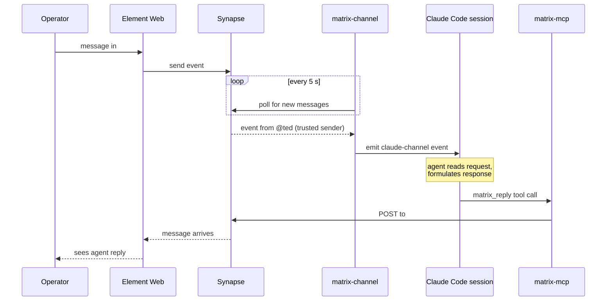

# matrix-channel

Claude Code Channel plugin — forwards Matrix room messages into interactive Claude Code sessions with permission relay for remote task approval.

## What it does

- Polls `#approvals`, `#task-queue`, `#announcements`, and `#dev` every 5 seconds
- Only processes messages from `@ted:claudebox.me` (trusted sender — prevents prompt injection)
- Emits Matrix messages as `<claude-channel>` events into the active Claude session
- Provides a `matrix_reply` tool so Claude can send replies back to rooms



## Usage

```bash
# Start an interactive session with Matrix channel active
claude --channels plugin:matrix-channel@/home/ted/repos/personal/matrix-channel \
       --dangerously-load-development-channels
```

`--dangerously-load-development-channels` is required during the Channels research preview for custom plugins.

## Setup

```bash
cd ~/repos/personal/matrix-channel
npm install
npm run build
```

## Environment variables

The plugin loads from `~/.claude-secrets/matrix.env` by default. Override with `MATRIX_ENV_FILE`:

```bash
MATRIX_ENV_FILE=/path/to/custom.env claude --channels ...
```

Required variables:

```
MATRIX_HOMESERVER_URL=https://matrix.claudebox.me
MATRIX_BOT_USER_ID=@claude-agent:claudebox.me
MATRIX_ACCESS_TOKEN=<bot token>
MATRIX_ROOM_TASK_QUEUE=!...:claudebox.me
MATRIX_ROOM_APPROVALS=!...:claudebox.me
MATRIX_ROOM_ANNOUNCEMENTS=!...:claudebox.me
MATRIX_ROOM_DEV=!...:claudebox.me
```

## Permission relay

When Ted sends a message in `#approvals`, Claude receives it as a channel event and can respond with `matrix_reply` to approve or reject the pending task. The channel plugin bridges the reply back to Matrix, completing the relay.

## Security

- Only `@ted:claudebox.me` messages are forwarded — all other senders are silently dropped
- Since tokens are seeded at startup so historical messages are not replayed
- No filesystem access — credentials loaded from env file at startup only
